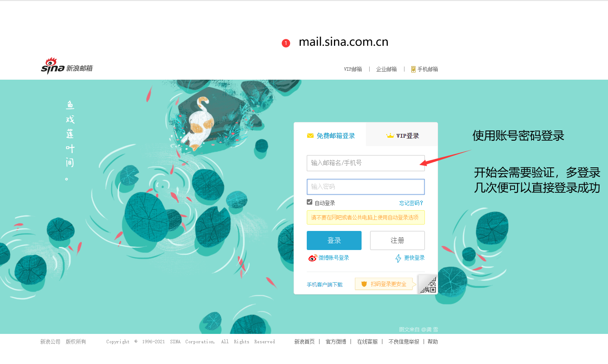
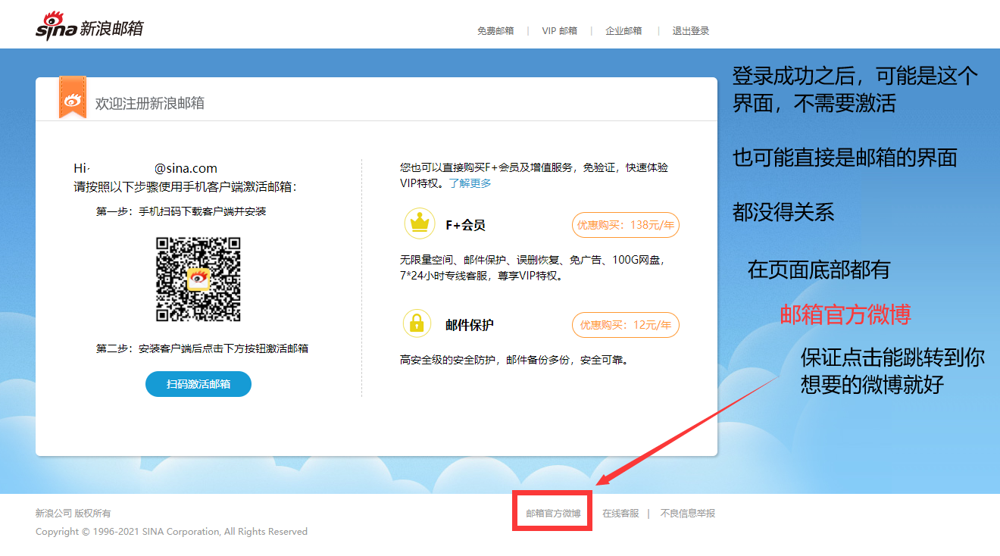

# gugubot -- 微博咕咕机器人  


项目基于`python3.6+`与`requests`模块，纯手工模拟微博登录、发布微博、上传图片、发布定时微博等功能。  

**项目最佳实践**：[鸽鸽bot](https://weibo.com/u/6015545982)  （欢迎关注）

## 如何运行
 - 克隆仓库，并确保有`python3.6+`环境与`requests`模块
 - 一个**绑定了手机**的微博账号，并确保在网页版微博中启动**新版微博**，具体在主页的右上位置
 - 使用该账号注册[新浪邮箱](https://mail.sina.com.cn)，并**重复登录邮箱**直到无需扫码登录（有图片验证码无妨）
 
 
 - 在`weibo.py`或`gugubot.py`文件末尾添加账号信息
 - 配置`log.json`中`error_mail_handler`字段或直接删除此字段
 - 齐活

## 文件介绍
 - `login.py` - 模拟微博登录流程，获取微博cookies
 - `weibo.py` - 实现发布微博功能，包括单文本微博、图片微博、定时微博等
 - `gugubot.py` - 基于上述模块，实现了整点发布报时微博的功能，并且实现了自动转发每日必应图片、今日诗词等功能

## 可能出现的问题
1.  `Unable to configure root logger`,`Unable to add handler 'error_mail_handler'`类似这种与logger相关的错误  
**A**: 没有设置好`log.json`，要么配置好邮箱，要么删除配置邮箱相关语句，你可以直接用这个。  
``` json
{
    "version": 1,
    "disable_existing_loggers": true,
    "formatters": {
        "simple": {
            "datefmt": "%m/%d %H:%M:%S",
            "format": "%(asctime)s - %(module)s%(lineno)d - %(levelname)s - %(message)s"
        }
    },
    "handlers": {
        "console": {
            "class": "logging.StreamHandler",
            "level": "DEBUG",
            "formatter": "simple",
            "stream": "ext://sys.stdout"
        },
        "info_file_handler": {
            "class": "logging.handlers.RotatingFileHandler",
            "level": "INFO",
            "formatter": "simple",
            "filename": "log/info.log",
            "maxBytes": 10485760,
            "backupCount": 20,
            "encoding": "utf8"
        },
        "error_file_handler": {
            "class": "logging.handlers.RotatingFileHandler",
            "level": "ERROR",
            "formatter": "simple",
            "filename": "log/errors.log",
            "maxBytes": 10485760,
            "backupCount": 1,
            "encoding": "utf8"
        }
    },
    "root": {
        "level": "DEBUG",
        "handlers": [
            "console",
            "info_file_handler",
            "error_file_handler"
        ]
    }
}
``` 


2. `KeyError: 'XSRF-TOKEN'`  
**A**: 没有开启新版微博，去主页右上区域，手动打开

3. 出现很多发布错误的定时微博  
**A**: 这是新版微博的限制，暂时无法解决，你可以减少发布的频率，或者尝试不使用定时功能

## License
GPL v3.0